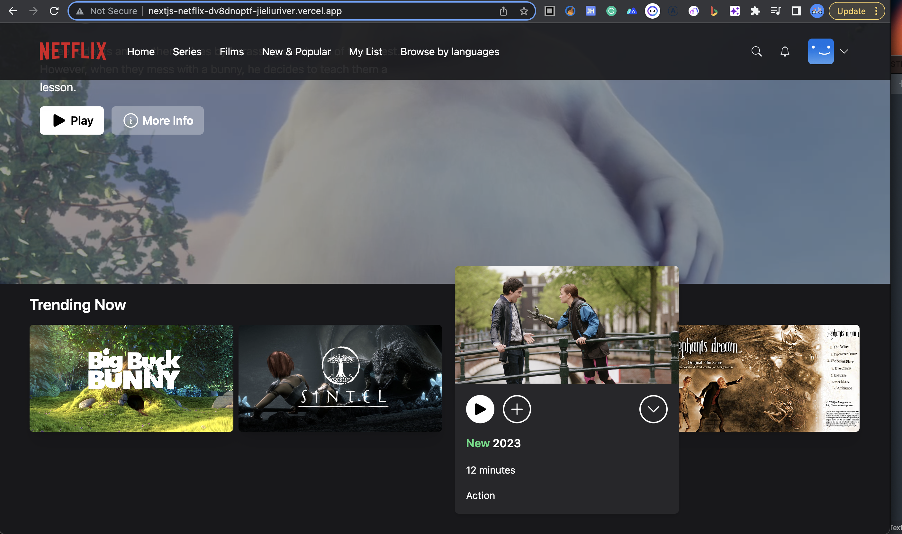
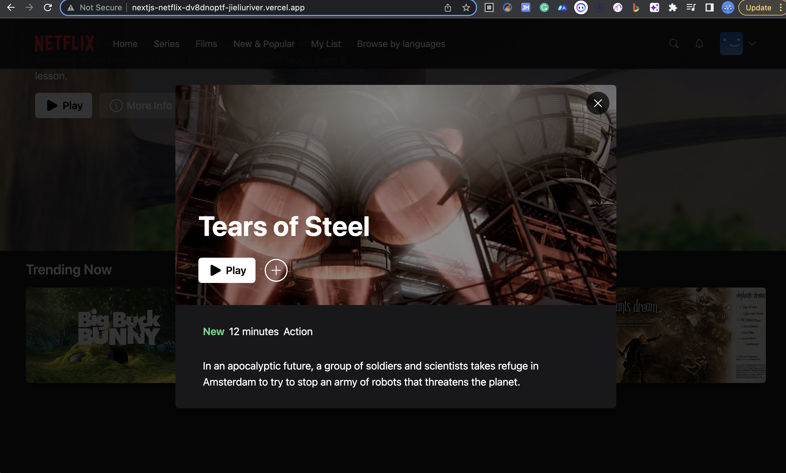
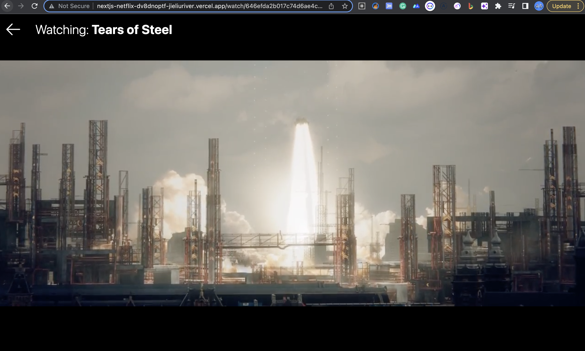
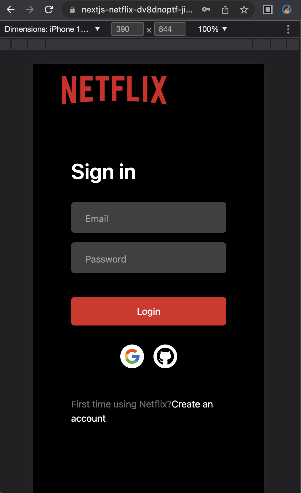
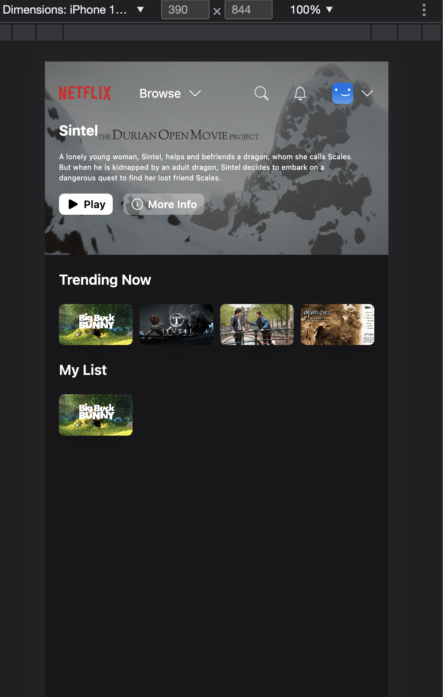

# Netflix Clone Web App

This is an open-source project built using `Next.js` framework and designed to replicate the Netflix website. The app uses various libraries such as `Tailwind CSS`, `Zustand`, and `SWR`. It uses MongoDB Atlas as the backend and Prisma ORM as the database interface.

Note:
This project was built following the tutorial at [YouTube](https://www.youtube.com/watch?v=mqUN4N2q4qY.),  We would like to express our gratitude to the author of the tutorial for providing such a helpful resource for building this project.

## Demo
You can view a [live demo](https://nextjs-netflix-dv8dnoptf-jieliuriver.vercel.app) of this project online at the following link:









## Technology Stack
This project uses the following technologies:

- Tailwind CSS
- Zustand
- SWR
- MongoDB Atlas
- Prisma ORM

## Installation
To install the project, please follow these steps:

1. Clone the repository to your local machine
2. Install the dependencies using the following command
3. Add `.env` and update the variables with your own values
    ```
    DATABASE_URL=
    NEXTAUTH_JWT_SECRET=
    NEXTAUTH_SECRET=
    GITHUB_ID=
    GITHUB_SECRET=

    GOOGLE_CLIENT_ID=
    GOOGLE_CLIENT_SECRET=
    ```

## Configuration
To use the authentication features of this app, you need to set up OAuth 2.0 credentials for GitHub and Google in their respective developer consoles.

### GitHub OAuth App
1. Visit the GitHub Developer Settings page and click on "New OAuth App".
2. Fill in the details and the callback URL as http://localhost:3000/api/auth/callback/github.
3. After creating the app, copy the Client ID and Client Secret to your .env.local file as GITHUB_ID and GITHUB_SECRET respectively.

### Google OAuth App

1. Go to the Google Cloud Console.
2. Create a new project or select an existing one.
3. In the left menu, click on "APIs & Services" > "Credentials".
4. Click on "Create credentials" and select "OAuth client ID".
5. Choose "Web application" as the application type.
6. Add http://localhost:3000 to the "Authorized JavaScript origins" and http://localhost:3000/api/auth/callback/google to the "Authorized redirect URIs".
7. After creating the client ID, copy the Client ID and Client Secret to your .env.local file as GOOGLE_ID and GOOGLE_SECRET respectively.

## Usage
To run the project locally, use the following command:
```
npm run dev
```

This will start the development server at http://localhost:3000. You can then navigate to the app in your browser.

## Features
The app includes the following features:

1. Registration and login with email, GitHub, and Google accounts.
2. User dashboard to display personal information and favorite movies.
3. Home page to display random movie and movies by genre.
4. Movie player to play movies.
5. Ability to add and remove movies from favorites list.

## Deployment
The app is deployed on Vercel. To deploy your own version of the app, you can create an account on Vercel and follow the instructions to deploy the app


## Prisma
Using [Prisma](https://www.prisma.io/docs) with Next.js provides a scalable and efficient solution for managing the MongoDB database for this project. It also enables easy schema migrations, which makes it simple to modify the database schema without losing data. Prisma's support for multiple databases, including MongoDB, also makes it a flexible choice for managing different types of databases in Next.js applications.

To initialize Prisma, run the following command:
```
npx prisma init
```
This will create the prisma directory with the necessary files and configuration.

To create the database schema in the database, run the following command:
```
npx prisma db push
```
This will apply the changes in the Prisma schema to the database.
